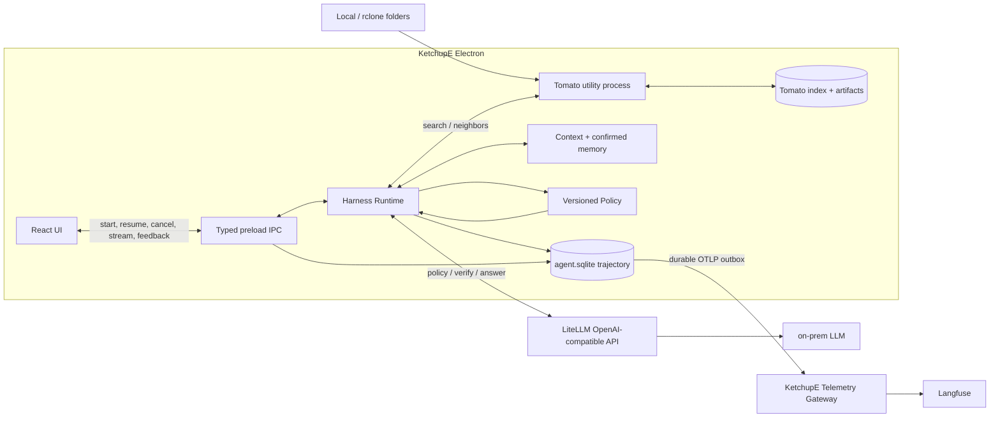

# KetchupE v3.0 — Local RAG Agent Harness 구현 계획

- 상태: 구현 기준 문서
- 기준일: 2026-09-14
- 범위: KetchupE desktop client, local data, 중앙 OTLP 수집 계약. MARU와 benchmark 구현은 범위 밖이다.

## 1. 궁극적인 목표

KetchupE는 단순한 문서 챗봇이 아니다. **제한된 로컬 연산 자원에서 agent가 불확실성과 task 난도를 추정하고, 검색·질문·검증·답변·종료 중 다음 행동을 선택하는 orchestration policy를 개발하고 실제 retrieval workflow에서 그 효과를 검증하는 local RAG agent client**다.

첫 제품 workflow는 단순하게 유지한다.

```text
로컬 문서 → Tomato(parse/chunk/embed/index/search)
          → KetchupE Harness(policy + context + memory + budget)
          → LiteLLM → on-prem LLM
          → citation이 있는 답변 + 전체 trajectory
```

핵심 자산은 UI나 특정 prompt가 아니라 다음 세 가지다.

1. 사용자의 문서를 구조와 출처를 보존해 찾는 Tomato
2. 다음 행동을 명시적으로 결정하고 제한하는 versioned policy
3. 외부 benchmark가 재구성할 수 있는 versioned trajectory 계약

### 제품 가설

고정된 `항상 검색 후 답변`보다 task 난도와 현재 근거를 이용해 `SEARCH`, `ASK`, `VERIFY`, `ANSWER`, `STOP`을 선택하면 같은 정답률에서 검색 횟수·model call·latency를 줄이거나, 같은 비용에서 task success를 높일 수 있다.

이 가설은 느낌이 아니라 다음 순환으로 검증한다.

```text
production trajectory
  → 실패/불확실 case 후보 추출
  → 비식별화 + 사람 label
  → versioned golden dataset
  → baseline/candidate policy replay와 end-to-end 실행
  → 품질·calibration·비용 비교
  → 이긴 profile만 승격
```

### v3.0에서 반드시 되는 것

1. 사용자가 매번 파일을 지정하지 않아도 활성화된 local collection 전체를 검색한다.
2. 로컬 폴더, rclone으로 동기화된 Google Drive 폴더, Notion export 폴더를 같은 collection으로 취급한다.
3. HWP/HWPX/PDF/DOCX/XLS/XLSX/MD/TXT/이미지 OCR을 구조와 locator를 보존해 검색한다.
4. agent가 `SEARCH`, `ASK`, `VERIFY`, `ANSWER`, `STOP` 중 다음 행동을 고르고 그 이유·난도·성공 확률을 기록한다.
5. 최근 대화, workspace 지침, 활성 collection, 사용자가 확인한 장기 기억을 다음 run에 사용한다.
6. 모든 policy decision, model call, retrieval, verification, answer와 사용자 반응을 한 trajectory로 연결한다.
7. release와 retrieval/policy/answer profile SHA를 중앙 trajectory에 남긴다.
8. macOS와 Windows의 서명된 설치본에서 같은 기능이 동작한다.

### 이번 범위에서 하지 않는 것

- MARU, 팀 문서, 인증과 권한
- KetchupE가 Google Drive/Notion API를 직접 구현하는 것; (rclone/export로 local folder는 다른 프로젝트에서 진행됨.)
- 파일 수정, shell, browser처럼 부작용이 있는 action tool
- trace를 이용한 실시간 online learning 또는 자동 prompt 배포
- 사용자가 확인하지 않은 장기 기억의 자동 확정
- 외부 trace SaaS를 local trace의 원본으로 사용하는 것
- multi-agent와 `DELEGATE` 구현

`DELEGATE`는 궁극 action set에 포함하지만, 외부 benchmark에서 병목과 이득이 확인된 뒤 추가한다. 현재는 미래용 registry나 handoff framework를 만들지 않는다.

## 2. 핵심 설계 원칙

1. **Policy를 framework 안에 숨기지 않는다.** 매 step의 입력 상태, 선택 행동, 관측 결과를 KetchupE 타입으로 남긴다.
2. **Model의 자신감 하나를 사실로 믿지 않는다.** self estimate, retrieval 품질, citation 검증, 실제 성공, 사용자 반응을 따로 기록하고 calibration을 측정한다.
3. **Tomato는 retrieval만 한다.** 대화, 기억, policy, model 호출을 알지 못한다.
4. **평가용 제품 로직을 복제하지 않는다.** 외부 benchmark는 평가 대상 KetchupE commit SHA를 고정하고 Harness/Tomato adapter를 호출한다.
5. **제품 상태는 로컬, 운영 관측은 중앙이다.** 대화와 index의 원본은 local SQLite에 두되, 서비스 소유 OTLP gateway로 trajectory를 중앙 수집한다. SQLite `telemetry_outbox`는 사용자의 benchmark export가 아니라 전송 내구성을 담당한다.
6. **비용도 품질이다.** 정답률뿐 아니라 hop, latency, token, local CPU/RAM을 함께 비교한다.
7. **처음에는 작게 시작한다.** Tomato, LiteLLM, SQLite, 명시적 loop만 구현하고 multi-agent/online training은 측정 결과가 요구할 때 추가한다.

## 3. 확정 기술 결정

| 항목               | 결정                                                                                                           |
| ------------------ | -------------------------------------------------------------------------------------------------------------- |
| application        | 기존 React 19 + Electron 39 + TypeScript 유지                                                                  |
| orchestration 위치 | Electron main process의 `Harness Runtime`                                                                      |
| policy             | `PolicyState → PolicyDecision → Observation` 계약을 가진 versioned policy                                      |
| Tomato 원본        | `/Users/jm/Documents/GitHub/tomato`; 필요한 core와 테스트만 KetchupE로 이동                                    |
| Tomato 실행        | `electron/tomato` module을 Electron `utilityProcess`에서 실행                                                  |
| local DB           | Node 내장 `node:sqlite`; agent state DB와 Tomato index DB 분리                                                 |
| model gateway      | 이미 운영 중인 LiteLLM의 OpenAI-compatible endpoint 사용                                                       |
| model transport    | Phase 0 호환성 검증 후 AI SDK Core의 OpenAI-compatible provider 사용; 실패 시 `openai` SDK adapter 하나로 대체 |
| streaming          | 최종 answer만 LiteLLM SSE → Electron main → typed IPC로 전달                                                   |
| retrieval          | 기존 Tomato의 KorDoc + FTS5/BM25 + multilingual E5 + RRF hybrid 재사용                                         |
| 기본 검색          | 활성 collection 전체, hybrid, top 8; embedding 전에는 keyword fallback                                         |
| secret             | Electron `safeStorage`로 암호화하고 renderer/trace에 노출하지 않음                                             |
| trace              | local SQLite가 제품 상태 원본, 서비스 소유 OTLP gateway가 Langfuse 중앙 미러를 생성                      |
| benchmark          | 별도 repository가 dataset/runner/importer/result를 소유하고 고정된 KetchupE commit의 adapter를 호출             |

### AI SDK 사용 경계

`ai`와 `@ai-sdk/openai-compatible`은 다음 보일러플레이트만 맡기는 후보이다.

- OpenAI-compatible base URL과 인증
- text streaming
- tool/structured output 정규화
- abort와 usage 수집

`ToolLoopAgent`가 policy를 대신 결정하게 하지 않는다. KetchupE는 AI SDK Core의 단일 호출 함수로 policy decision과 answer generation을 수행하고, 반복·budget·state·trace는 직접 소유한다. 이 경계 덕분에 policy를 독립적으로 replay하고 A/B 할 수 있다.

Phase 0에서 실제 LiteLLM model alias로 다음 네 항목을 통과시키고 dependency를 하나로 확정한다.

1. 일반 text SSE
2. schema에 맞는 policy decision/tool call
3. abort/timeout
4. streaming usage 또는 별도 usage 수집

AI SDK OpenAI-compatible provider가 네 항목을 통과하면 `ai` + `@ai-sdk/openai-compatible`만 쓴다. 실패하면 `openai` SDK 기반 `ModelClient`만 쓴다. 둘을 동시에 제품 경로에 유지하지 않는다.

### 이미 준비된 LiteLLM 연결

LiteLLM과 vLLM 배포는 신규 구현 대상이 아니다.

```text
baseURL: https://centinels.ml2-alpha.com/v1/
apiKey: <LITELLM_API_KEY>
model: <LITELLM_MODEL_ALIAS>
chat endpoint: POST /chat/completions
```

AI SDK 후보 연결은 다음 모양이다.

```ts
import { createOpenAICompatible } from "@ai-sdk/openai-compatible";

const litellm = createOpenAICompatible({
  name: "ketchupe-litellm",
  baseURL: "https://centinels.ml2-alpha.com/v1/",
  apiKey: await loadLiteLLMKey(),
  includeUsage: true,
});

const model = litellm(settings.modelAlias);
```

- 개발 환경에서는 `LITELLM_API_KEY=<직접 입력>`으로 주입한다.
- signed app에서는 설정 화면에서 입력받아 `safeStorage`로 저장한다.
- API key는 repository, profile, trace, benchmark result에 넣지 않는다.
- model alias는 profile에 기록하되 key와 gateway 내부 routing은 기록하지 않는다.

## 4. 전체 아키텍처



### 책임 경계

| 영역            | 책임                                                   | 하지 않는 것                      |
| --------------- | ------------------------------------------------------ | --------------------------------- |
| React renderer  | 질문, stream, 컨텍스트·폴더, memory, feedback UI | filesystem, DB, API key 직접 접근 |
| Harness Runtime | context, policy step, budget, tool 실행, answer, trace | parsing/OCR/embedding 직접 실행   |
| Policy          | 상태를 보고 다음 action과 estimate를 반환              | tool 실행, DB 쓰기, 무제한 반복   |
| Tomato worker   | scan, parse, chunk, embed, index, search, locator      | 대화, 기억, policy, LLM 호출      |
| LiteLLM         | configured model alias를 on-prem model로 routing       | KetchupE state와 local file 접근  |

Tomato worker가 죽으면 현재 tool을 `TOOL_UNAVAILABLE`로 끝내고 한 번만 재시작한다. Harness는 진행 중인 step을 무한 재시도하지 않는다.

## 5. repository 구조

```text
KetchupE/
├── electron/
│   ├── main.ts
│   ├── preload.js
│   ├── agent/
│   │   ├── contracts.ts       # state, decision, observation, event
│   │   ├── modelClient.ts     # LiteLLM policy/verify/answer calls
│   │   ├── context.ts         # history + workspace instruction + memory selection
│   │   ├── memory.ts          # user-authored/confirmed memory CRUD + FTS
│   │   ├── policy.ts          # policy prompt/profile + decision validation
│   │   ├── harness.ts         # 유일한 bounded orchestration loop
│   │   ├── tools.ts           # Tomato tool schema와 실행
│   │   ├── verify.ts          # evidence/citation invariants
│   │   └── trace.ts           # SQLite trace + transition 복원
│   ├── db/
│   │   ├── openAgentDb.ts
│   │   └── 001_agent.sql
│   ├── ipc/
│   │   ├── agentHandlers.ts
│   │   └── collectionHandlers.ts
│   ├── collectionWatchers.ts
│   ├── tomato/
│   │   ├── tomato.ts
│   │   ├── embedding.ts
│   │   └── tomato.test.ts
│   └── workers/tomato.worker.ts
├── src/Features/Agent/
│   ├── hooks/useAgentRun.ts
│   └── components/
├── scripts/telemetry-gateway.ts
└── KETCHUPE_V3_ARCHITECTURE.md
```

현재 Tomato 구현을 다시 작성하지 않는다.

- repository: [tomato](/Users/jm/Documents/GitHub/tomato)
- retrieval core: [tomato.ts](/Users/jm/Documents/GitHub/tomato/src/tomato.ts)
- embedding: [embedding.ts](/Users/jm/Documents/GitHub/tomato/src/embedding.ts)
- CLI 동작 참고: [cli.ts](/Users/jm/Documents/GitHub/tomato/src/cli.ts)
- smoke tests: [smoke.test.ts](/Users/jm/Documents/GitHub/tomato/test/smoke.test.ts)

`tomato.ts`, `embedding.ts`, 필요한 테스트를 이동한다. 제품에서 CLI, 별도 HTTP server, workspace package는 만들지 않는다.

## 6. Runtime 단위와 수명

`session`, `turn`, `trajectory`를 혼용하지 않는다. 제품과 DB에서는 다음 다섯 단위만 사용한다.

```text
Workspace
└── Thread (= sidebar의 채팅방)
    ├── Run 1 (= 하나의 사용자 목표)
    │   ├── Message 1..N
    │   └── Step 1..N (= policy trajectory)
    ├── Run 2
    └── Run 3
```

| 단위        | 의미                               | 시작과 종료                                    | 보존 범위                                  |
| ----------- | ---------------------------------- | ---------------------------------------------- | ------------------------------------------ |
| `Workspace` | 작업 환경                          | 앱이 `default` 1개를 보장; 현재 생성/삭제 UI 없음 | workspace 지침, memory on/off, collections, confirmed memory |
| `Thread`    | sidebar의 채팅방                   | 새 채팅 생성부터 삭제까지                      | 모든 message와 여러 run                    |
| `Run`       | 하나의 사용자 목표를 처리하는 실행 | 최초 user message부터 `ANSWER`/`STOP`/실패까지 | state, evidence, outcome                   |
| `Message`   | user/assistant의 실제 발화         | 발화마다 생성                                  | thread와 run에 연결                        |
| `Step`      | policy 판단 한 번                  | `state → decision → observation`               | run 안에서 순번 증가                       |

`Trajectory`의 기본 저장·평가 단위는 **Run 하나에 속한 모든 Step**이다. Thread trajectory는 여러 run을 조회 화면에서 묶어 부르는 표현일 뿐 별도 레코드가 아니다. 앱 실행/종료를 뜻하는 process session도 제품 데이터 단위로 만들지 않는다.

### Run 경계

```text
일반 입력
  → 같은 Thread에 새 Run 생성
  → Step 반복
  → ANSWER/STOP/실패로 Run 종료

ASK 선택
  → 현재 Run을 waiting_user로 저장
  → agent 질문 Message 저장
  → 다음 user 입력을 같은 Run에 연결하여 resume
  → ANSWER/STOP/실패로 Run 종료
```

- `waiting_user`인 run이 있으면 다음 user message가 그 run을 재개한다.
- 이전 run이 이미 끝났다면 후속 질문도 같은 thread 안의 새 run이다. 최근 thread message가 context를 연결한다.
- 한 thread에는 `running` 또는 `waiting_user` run이 최대 하나다. `running` 중 새 입력은 막고 cancel 또는 완료를 기다린다.
- 완료/실패한 run의 transition은 수정하지 않고 사용자 interaction event만 추가한다.
- 대화 message, run trajectory, durable memory는 서로 다른 데이터다. Thread나 run 전체를 memory로 자동 저장하지 않는다.

### Thread와 sidebar 동작

1. Sidebar에서 workspace별 thread 목록을 여러 개 생성하고 `updated_at DESC`로 표시한다.
2. 새 thread의 제목은 첫 user message 앞 40자로 정하고 사용자가 바꾸거나 삭제할 수 있게 한다. 열린 run이 있는 thread는 먼저 중단해야 삭제할 수 있고, 삭제 시 FK cascade로 run/message/trace를 함께 제거한다.
3. Thread 선택 시 최신 message 50개를 불러오고, 더 오래된 message는 같은 API로 이전 page를 요청한다.
4. 과거 thread를 선택해 새 message를 보내면 그 thread에 새 run을 만들고 기존 대화의 최근 12개 message를 context로 사용한다.
5. 앱 재시작 후에도 thread/run/message가 SQLite에서 복원된다.
6. Context에 쓰는 최근 12개와 UI에 표시하는 50개 page는 별도 기준이다. UI history 전체를 model에 보내지 않는다.

## 7. Orchestration policy 계약

### 7.1 action 의미

| action   | 의미                                                      | terminal  |
| -------- | --------------------------------------------------------- | --------- |
| `SEARCH` | Tomato 검색 또는 이미 찾은 chunk 주변 문맥 확장           | 아니오    |
| `ASK`    | 정답에 필요한 최소 정보를 사용자에게 질문하고 resume 대기 | 일시 정지 |
| `VERIFY` | 현재 evidence가 특정 claim을 지지하는지 별도 확인         | 아니오    |
| `ANSWER` | 확보한 context/evidence로 최종 답변 생성                  | 예        |
| `STOP`   | 근거 부족, 불가능, budget 소진 등을 명시하고 종료         | 예        |

`DELEGATE`는 이후 연구 단계의 여섯 번째 action이다. v3.0 schema와 UI에 빈 handoff 기능을 미리 넣지 않는다.

현재 source는 Tomato의 local corpus 하나뿐이므로 source routing 문제를 억지로 만들지 않는다. v3.0의 tool 선택 평가는 `검색 안 함 vs 검색`, `새 query vs neighbors`, `ASK/VERIFY 전환`이다. MCP나 외부 agent가 추가되면 같은 `PolicyDecision` benchmark에 provider/tool label을 확장한다.

### 7.2 난도와 불확실성 정의

`taskDifficulty` label은 다음처럼 고정한다.

| 값  | 의미                                                                        |
| --- | --------------------------------------------------------------------------- |
| 0   | 대화/기억만으로 답할 수 있고 retrieval이 불필요                             |
| 1   | local search 1회로 충분                                                     |
| 2   | query rewrite, neighbors, 여러 evidence 비교가 필요                         |
| 3   | 사용자 clarification 또는 별도 verification 없이는 안전하게 완료하기 어려움 |

`predictedSuccess`는 **현재 남은 budget 안에서 task를 성공할 확률**의 0~1 추정치다. `evidenceSufficiency`는 **현재 evidence만으로 핵심 claim을 뒷받침할 수 있는 정도**의 0~1 추정치다. 두 값은 UI의 확정 사실로 표시하지 않고 calibration 대상 signal로만 저장한다.

### 7.3 타입

```ts
type AgentErrorCode =
  | "MODEL_AUTH"
  | "MODEL_TIMEOUT"
  | "MODEL_PROTOCOL"
  | "INVALID_DECISION"
  | "TOOL_TIMEOUT"
  | "TOOL_UNAVAILABLE"
  | "BUDGET_EXCEEDED"
  | "INVALID_CITATION"
  | "CANCELLED"
  | "INTERNAL";

type PolicyAction = "SEARCH" | "ASK" | "VERIFY" | "ANSWER" | "STOP";

type PolicyState = {
  runId: string;
  step: number;
  userGoal: string;
  activeTask?: string; // DB/API 호환 이름; 의미는 workspace instruction
  selectedMemories: Array<{
    id: string;
    kind: "preference" | "fact" | "task";
    content: string;
  }>;
  activeCollections: string[];
  recentMessages: Array<{ role: "user" | "assistant"; content: string }>;
  evidence: Array<{
    evidenceId: string;
    sourceId: string;
    title: string;
    breadcrumb: string[];
    locator: Locator;
    snippet: string; // 최대 400자
    score: number;
  }>;
  signals?: {
    evidenceCount: number;
    uniqueSourceCount: number;
    topEvidenceScore: number;
    lastSearchResultCount?: number;
    lastVerificationSupported?: boolean;
  };
  previousDecisions: PolicyAction[];
  lastObservation?: Observation;
  remaining: {
    steps: number;
    modelCalls: number;
    searches: number;
    verifies: number;
    wallTimeMs: number;
  };
};

type PolicyDecision = {
  action: PolicyAction;
  taskDifficulty: 0 | 1 | 2 | 3;
  predictedSuccess: number;
  evidenceSufficiency: number;
  reasonCode:
    | "NO_RETRIEVAL_NEEDED"
    | "MISSING_EVIDENCE"
    | "QUERY_REWRITE"
    | "NEED_NEIGHBORS"
    | "MISSING_USER_INPUT"
    | "CONFLICTING_EVIDENCE"
    | "ENOUGH_EVIDENCE"
    | "UNSUPPORTED"
    | "BUDGET_LIMIT";
  search?: {
    tool: "search_local_docs" | "get_document_context";
    query?: string;
    evidenceId?: string;
  };
  question?: string;
  claimsToVerify?: string[];
  stopReason?: string;
  policyVersion: string;
};

type Observation =
  | {
      kind: "search";
      resultIds: string[];
      effectiveMode: "keyword" | "semantic" | "hybrid";
      latencyMs: number;
    }
  | { kind: "user"; messageId: string }
  | {
      kind: "verification";
      supported: boolean;
      missingClaims: string[];
      confidence: number;
    }
  | { kind: "tool_error"; code: AgentErrorCode };

type PolicyTransition = {
  state: PolicyState;
  decision: PolicyDecision;
  observation?: Observation;
  outcome?: "success" | "failure" | "abstained" | "waiting_user";
  reward?: number;
};

type PolicyProfile = {
  version: string;
  strategy: "llm" | "always-search";
  allowedActions: PolicyAction[];
  modelAlias: string;
  promptVersion: string;
  temperature: number;
  maxSteps: number;
  maxModelCalls: number;
  maxSearchCalls: number;
  maxVerifyCalls: number;
  runTimeoutMs: number;
};

type VerifyInput = {
  userGoal: string;
  claims: string[];
  evidence: PolicyState["evidence"];
};

type VerificationResult = {
  supported: boolean;
  missingClaims: string[];
  confidence: number;
};

type AnswerInput = {
  userGoal: string;
  context: string;
  evidence: PolicyState["evidence"];
};

type AnswerEvent =
  | { type: "text_delta"; text: string }
  | { type: "completed"; promptTokens: number; completionTokens: number };
```

`decide()`는 실행 기능이 없는 `policy_decision` function tool 하나를 `toolChoice: required`로 호출하고 그 arguments를 `PolicyDecision`으로 사용한다. Main process가 schema와 0~1 범위를 검증하고, 허용되지 않은 action이나 budget 초과 action은 실행하지 않는다. `reward`는 offline label/scorer만 기록하며 runtime이 임의 생성하지 않는다.

### 7.4 model client

제품 client와 deterministic harness test가 같은 호출 계약을 사용하므로 이 한 interface는 유지한다. 외부 benchmark adapter도 평가 대상 commit의 이 계약을 호출한다.

```ts
interface ModelClient {
  decide(
    state: PolicyState,
    profile: PolicyProfile,
    signal: AbortSignal,
  ): Promise<PolicyDecision>;
  verify(
    input: VerifyInput,
    profile: PolicyProfile,
    signal: AbortSignal,
  ): Promise<VerificationResult>;
  streamAnswer(
    input: AnswerInput,
    profile: PolicyProfile,
    signal: AbortSignal,
  ): AsyncIterable<AnswerEvent>;
}
```

Policy call은 짧은 non-streaming structured response다. `ANSWER`가 선택된 경우에만 별도 `streamAnswer`를 호출해 사용자에게 SSE token을 보낸다. 이 추가 model call의 latency/token은 OTLP에 기록하며, 외부 benchmark에서 단일 호출 방식이 더 낫다는 근거가 생길 때만 합친다.

## 8. Harness Runtime

```ts
const LIMITS = {
  maxSteps: 6,
  maxModelCalls: 8,
  maxSearchCalls: 3,
  maxVerifyCalls: 1,
  maxEvidence: 12,
  runTimeoutMs: 180_000,
  toolTimeoutMs: 30_000,
} as const;
```

```text
start/resume
  → context snapshot
  → decide(state)
  → decision validation + trace
  → SEARCH: Tomato 실행 → observation → 다음 step
  → ASK: 질문 저장/표시 → waiting_user → 사용자 응답으로 resume
  → VERIFY: evidence verifier → observation → 다음 step
  → ANSWER: answer SSE → citation invariant → completed
  → STOP: 이유를 표시 → abstained/completed
```

구현 규칙:

1. 같은 normalized query는 다시 실행하지 않고 이전 observation을 재사용한다.
2. `SEARCH`는 최대 3회, `VERIFY`는 최대 1회다.
3. `ASK`는 정답을 바꿀 누락 정보가 있을 때만 허용하고, 한 번에 질문 하나만 한다.
4. `VERIFY`는 선택적 semantic evidence check다. 존재하는 evidence ID와 locator를 확인하는 deterministic validation은 항상 실행한다.
5. 문서는 untrusted data다. 문서 안의 명령이 policy, tool scope, memory를 바꿀 수 없다.
6. chain-of-thought를 요청하거나 저장하지 않는다. `reasonCode`와 짧은 estimate만 기록한다.
7. citation은 run 안에서 발급한 `[[e1]]` 형식만 허용한다. 잘못된 citation은 한 번만 repair하고 실패하면 `INVALID_CITATION`이다.
8. budget/timeout/cancel은 model 판단보다 우선한다.

## 9. Tomato: local retrieval engine

Tomato는 qmd 전체를 설치하지 않고 필요한 검색 아이디어와 KorDoc parser를 결합한 현재 구현을 사용한다.

```text
scan
  → KorDoc/Markdown parser
  → canonical units + locator
  → structure-first chunks
  → SQLite FTS5/BM25
  → multilingual-e5-small embedding
  → cosine + RRF hybrid
  → source/chunk/locator evidence
```

### canonical output

```ts
type CanonicalUnit = {
  unitId: string;
  kind:
    | "heading"
    | "paragraph"
    | "list"
    | "table"
    | "sheet_range"
    | "ocr_region"
    | "code";
  text: string;
  breadcrumb: string[];
  locator: Locator;
};

type Locator = {
  pageStart?: number;
  pageEnd?: number;
  sheet?: string;
  cellRange?: string;
  blockRange?: [number, number];
  bbox?: [number, number, number, number];
};

type TomatoChunk = {
  chunkId: string;
  sourceId: string;
  unitIds: string[];
  body: string;
  breadcrumb: string[];
  locator: Locator;
  tokenCount: number;
};
```

표는 header를 반복해 row 단위로 나누고 일반 text는 같은 breadcrumb 안에서만 합친다. Markdown은 UI/debug artifact이고 canonical unit이 parsing/chunk benchmark의 계약이다.

### 제품 API

```ts
class Tomato {
  registerCollection(
    folder: string,
    name: string,
    ocr?: OcrMode,
  ): Promise<Collection>;
  sync(collection?: string, reason?: SyncReason): Promise<SyncReport>;
  search(
    query: string,
    options: {
      collections: string[];
      mode: "keyword" | "semantic" | "hybrid";
      limit: number;
    },
  ): Promise<SearchResult[]>;
  getNeighbors(
    chunkId: string,
    before: number,
    after: number,
  ): Promise<TomatoChunk[]>;
}
```

사용자에게 `add → update → embed`를 노출하지 않는다.

```text
register → scan/parse/chunk/index → keyword ready → background embed → hybrid ready
sync     → changed files only     → keyword ready → missing embed only
```

Embedding이 준비되지 않았거나 실패해도 keyword 검색을 계속하고 `effectiveMode: keyword`를 trajectory에 남긴다.

### collection 자동 sync

1. 등록 직후와 앱 시작 시 `fs.watch(root, { recursive: true })`를 collection마다 연다. 지원 OS는 macOS와 Windows다.
2. 연속 event는 collection 단위 1.5초 debounce로 합친다.
3. Collection별 sync는 single-flight다. 실행 중 변경은 `dirty = true`로 남기고 완료 후 한 번 더 실행한다.
4. update 후 변경 chunk만 background embedding한다. 검색은 마지막 정상 index를 계속 사용한다.
5. event 누락에 대비해 10분마다 size/mtime/hash 기반 reconciliation을 한다.
6. watcher 오류는 상태에 표시하고 1분 뒤 재연결한다.
7. `.git`, `node_modules`, OS metadata와 app-data 경로는 제외하고 symlink는 따라가지 않는다.
8. 수동 sync는 복구용으로 유지한다.

## 10. 지속형 context와 memory

| 계층           | 내용                                        | 수명                   |
| -------------- | ------------------------------------------- | ---------------------- |
| working        | 현재 state, decision, observation, evidence | run 완료까지           |
| conversation   | 최근 message 12개                           | thread 삭제까지        |
| workspace      | 모든 대화에 적용할 지침, 활성 collection     | 사용자가 변경할 때까지 |
| durable memory | 사용자가 확인한 preference/fact/task        | 사용자가 삭제할 때까지 |

선택 순서는 결정적으로 고정한다.

1. workspace instruction 1개(최대 1,000자)
2. memory가 켜져 있으면 pinned confirmed memory
3. memory가 켜져 있으면 현재 질문으로 SQLite FTS5 검색한 confirmed memory top 5
4. 최근 message 12개
5. 현재 user message

지침과 memory context는 합쳐 1,500 estimated tokens에서 자르고 선택/제외 ID를 `context.selected`에 남긴다. `workspaces.memory_enabled=0`이면 저장된 memory는 보존하지만 선택하지 않는다. 문서 원문을 memory로 복사하지 않는다. 문서 기반 memory는 `sourceId + locator + 사용자가 확인한 요약`만 저장한다.

사용자가 컨텍스트 패널에서 직접 추가한 memory는 사용자 의사가 명확하므로 즉시 `confirmed`가 된다. content는 500자로 제한하고 종류 검증 후 memory 행과 FTS를 한 transaction에서 갱신한다. 사용자는 수정·삭제·항상 적용(pin)할 수 있다. Model이 제안한 memory만 `pending`이고 사용자가 승인해야 `confirmed`가 된다. 자동 conversation summarization과 semantic memory index는 baseline에 넣지 않는다.

DB와 기존 TypeScript의 `active_task`/`activeTask` 이름은 migration 호환을 위해 유지하지만, 제품 의미는 “현재 작업”이 아니라 **workspace instruction**이다. 모델 prompt에는 `workspaceInstructions`로 전달하며 이 의미 변경에 맞춰 runtime prompt version은 `policy-2`, `grounded-answer-2`다.

Assistant message에는 생성 당시 실제 적용한 instruction과 memory를 다음 형태로 snapshot한다. 문서 evidence는 `citations`가 원본이므로 중복하지 않는다.

```ts
type AppliedContext = {
  workspaceInstruction?: string;
  memories: Array<Pick<Memory, "id" | "kind" | "content">>;
};
```

`messages.applied_context`를 답변 단위로 저장하므로 사용자가 나중에 지침이나 memory를 수정해도 과거 답변의 적용 내역은 바뀌지 않는다. UI는 답변 아래 “사용한 컨텍스트”에 이 snapshot과 실제 인용한 문서 제목·페이지를 함께 보여준다.

### 10.1 Renderer 패널 경계

오른쪽 sidebar는 **컨텍스트 / 폴더** 두 패널로 나눈다. 컨텍스트는 workspace instruction과 durable memory만 관리하고, 폴더는 Tomato collection 등록·활성화·동기화·해제를 담당한다. 가운데 질문 입력은 현재 thread/run에만 적용된다. 서로 수명이 다른 질문, 지침, memory, retrieval source를 한 입력이나 한 패널로 섞지 않는다.

## 11. Trajectory와 사용자 interaction

### 11.1 한 step의 기록

Harness의 여섯 layer는 다음처럼 적용한다.

| layer      | 기록/강제할 것                                       |
| ---------- | ---------------------------------------------------- |
| Input      | workspace snapshot, request ID, profile fingerprint  |
| Context    | 선택된 message/memory/collection ID와 token estimate |
| Model      | call purpose, alias, latency, usage, finish reason   |
| Tool       | schema validation, input hash, result IDs, timeout   |
| Policy     | state, decision, observation, budget, stop invariant |
| Evaluation | outcome, user interaction, scorer, baseline diff     |

```ts
type TraceEvent = {
  runId: string;
  seq: number;
  parentSeq?: number;
  type:
    | "run.started"
    | "context.selected"
    | "policy.decided"
    | "tool.started"
    | "tool.completed"
    | "model.started"
    | "model.completed"
    | "verification.completed"
    | "answer.validated"
    | "run.waiting_user"
    | "run.completed"
    | "run.failed"
    | "interaction.recorded"
    | "canvas.updated";
  stage:
    | "input"
    | "context"
    | "policy"
    | "retrieval"
    | "verification"
    | "generation"
    | "citation"
    | "runtime"
    | "feedback";
  startedAt: string;
  durationMs?: number;
  payload: Record<string, unknown>;
};
```

`policy.decided` payload는 실제 policy가 본 state snapshot, decision, profile hash를 포함한다. Local DB에는 user goal, 선택된 memory text, 최대 400자 evidence snippet을 저장해 replay 가능성을 보존하되 full chunk와 absolute path는 복제하지 않는다. 중앙 전송은 서비스가 고정한 content mode를 따르며 기본 `ops`에서 text와 ID를 HMAC으로 치환한다.

### 11.2 사용자 반응

```ts
type InteractionKind =
  | "accepted"
  | "retried"
  | "corrected"
  | "citation_opened"
  | "clarification_answered"
  | "abandoned"
  | "memory_confirmed"
  | "memory_rejected";
```

이 event는 weak label이다. 예를 들어 citation을 열지 않았다고 답변 실패가 아니며, 재질문했다고 항상 실패도 아니다. 자동 reward로 바로 사용하지 않고 candidate case 선정과 사람이 붙일 label의 우선순위에만 사용한다.

### 11.3 최초 실패 단계

```text
필수 memory/context 누락                      → context
난도·성공 확률·action label 불일치             → policy
gold evidence가 어떤 SEARCH에도 나오지 않음    → retrieval
충분한 evidence 뒤 불필요한 hop을 계속함        → policy
VERIFY가 잘못된 evidence를 통과시킴             → verification
gold evidence를 얻었지만 답의 핵심 claim이 틀림 → generation
없는 evidence 또는 틀린 locator 인용            → citation
timeout/protocol/budget 오류                    → runtime
```

## 12. 외부 Benchmark 계약

Benchmark runner, dataset, profile, Langfuse importer, 결과와 promotion 판단은 별도 repository가 소유한다. 이 client는 중앙에서 재구성 가능한 trajectory와 평가 대상 release/profile/corpus fingerprint만 제공한다.

### 12.1 suite 분리

| suite     | 고정 입력 → candidate 출력                  | 핵심 지표                                                                                                    |
| --------- | ------------------------------------------- | ------------------------------------------------------------------------------------------------------------ |
| parse     | raw file → canonical units                  | required-unit recall, locator accuracy, success rate                                                         |
| chunk     | frozen canonical units → chunks             | gold-span coverage, split violation, token p50/p95                                                           |
| retrieval | raw corpus + query → ranked evidence        | Recall@5/8, MRR@10, nDCG@10, locator accuracy, latency                                                       |
| rag       | frozen gold evidence → answer              | answer correctness, citation validity/coverage, tokens, latency                                             |
| policy    | frozen `PolicyState` → `PolicyDecision`     | action/tool accuracy, difficulty macro-F1, Brier, ECE, budget violation                                      |
| agent     | scripted messages → complete run trajectory | task success, `pass^k`, paired wins/losses, evidence gain/hop, action usage, calibration, citation validity, model/tool calls, tokens, CPU/RSS, latency |

Parsing, chunking, retrieval을 따로 측정해야 원인을 알 수 있고, end-to-end agent suite를 함께 돌려야 component 점수 개선이 실제 task success로 이어졌는지 알 수 있다.

### 12.2 dataset

다음 구조는 외부 benchmark repository의 책임이며 KetchupE client에는 두지 않는다.

```text
datasets/<dataset-version>/
├── manifest.json
├── corpus/                  # 공개/합성 raw files
├── canonical/               # 사람이 확인한 parser gold
├── parse-cases.jsonl
├── chunk-cases.jsonl
├── retrieval-cases.jsonl
├── rag-cases.jsonl          # frozen evidence → answer
├── policy-cases.jsonl       # frozen state + allowed action + difficulty/outcome label
├── agent-cases.jsonl        # multi-turn script + deterministic user reply
└── memories.jsonl
```

초기 크기는 작게 시작한다.

- 문서 12개: 각 format, 표, scan/OCR, 긴 section 포함
- parse 30 case
- chunk 20 case
- retrieval 30 query: exact/semantic/table/no-answer 혼합
- policy 30 state: no-search/search/rewrite/ask/verify/stop 균형
- agent 12 scenario: 단일 검색, multi-hop, clarification, verification, memory 포함

Gold는 chunk ID가 아니라 원본 `sourceKey + locator overlap + mustContain`으로 정의한다. Chunker가 바뀌어도 같은 label을 재사용하기 위해서다.

```json
{
  "queryId": "ret-001",
  "query": "퇴직 전 연차는 어떻게 정산하나?",
  "relevant": [
    {
      "sourceKey": "handbook.hwpx",
      "locator": { "pageStart": 12, "pageEnd": 12 },
      "mustContain": ["미사용 연차", "정산"]
    }
  ]
}
```

Policy case는 한 지점에서 허용되는 행동을 label한다. 단 하나의 정답 action을 강제할 수 없는 경우 `allowedActions`를 쓴다.

```json
{
  "caseId": "policy-014",
  "stateFixture": "states/policy-014.json",
  "difficulty": 3,
  "allowedActions": ["ASK"],
  "successWithinBudget": false,
  "requiredReasonCodes": ["MISSING_USER_INPUT"]
}
```

Agent case의 user simulator는 LLM이 아니라 고정 script다. `ASK` 문구가 label의 의미를 충족하면 준비된 답을 반환한다. 그래야 policy마다 같은 사용자 조건을 재현할 수 있다.

### 12.3 실제 trajectory에서 golden set 만들기

1. 서비스 소유 OTLP gateway가 `failed`, `retried`, `corrected`, 낮은 predicted success, 과도한 hop case를 Langfuse에 중앙 수집한다.
2. 관리자가 Observations API v2 또는 Blob Export로 후보 trajectory를 benchmark repository의 private import 영역에 가져온다.
3. 사람이 원본 또는 공개 가능한 재현 corpus를 준비하고 relevant locator, expected claim, allowed action, difficulty, outcome을 붙인다.
4. 두 번째 검토자가 label과 개인정보 제거를 확인한다.
5. Dataset version과 SHA-256을 고정한 뒤에만 golden set에 합친다.

실제 trajectory는 좋은 **후보 source**지만 그 자체가 gold는 아니다. Langfuse dataset/annotation queue로 선별·검토하고, canonical dataset은 private object storage의 immutable snapshot과 외부 benchmark repository의 manifest SHA로 고정한다.

### 12.4 profile

Retrieval과 policy를 따로 versioning한다.

```json
{
  "name": "baseline-v1",
  "retrieval": {
    "parser": "kordoc-4.10.0+markdown-1",
    "chunker": "structure-1",
    "targetTokens": 600,
    "maxTokens": 850,
    "overlapTokens": 80,
    "embedding": "Xenova/multilingual-e5-small",
    "mode": "hybrid",
    "fusion": "rrf",
    "rrfK": 60,
    "topK": 8
  },
  "policy": {
    "version": "orchestration-1",
    "strategy": "llm",
    "allowedActions": ["SEARCH", "ASK", "VERIFY", "ANSWER", "STOP"],
    "modelAlias": "<LITELLM_MODEL_ALIAS>",
    "promptVersion": "policy-2",
    "temperature": 0,
    "maxSteps": 6,
    "maxModelCalls": 8,
    "maxSearchCalls": 3,
    "maxVerifyCalls": 1,
    "runTimeoutMs": 180000
  },
  "answer": {
    "modelAlias": "<LITELLM_MODEL_ALIAS>",
    "promptVersion": "grounded-answer-2",
    "temperature": 0
  }
}
```

각 부분의 canonical JSON SHA-256을 `retrievalProfile`, `policyProfile`, `answerProfile` fingerprint로 저장한다. API key는 profile에 없다.

### 12.5 실행과 A/B

실행 명령과 CI는 외부 benchmark repository가 정의한다. 모든 실행은 dataset version, KetchupE commit SHA, profile SHA, model alias, hardware fingerprint를 manifest에 기록해야 한다.

- Parser/chunker/retriever를 바꿀 때는 policy/model을 고정한다.
- Policy/prompt를 바꿀 때는 corpus/retrieval profile/model을 고정한다.
- Component에서 이긴 candidate만 end-to-end agent suite로 조합 효과를 확인한다.
- Retrieval은 결정적 1회, model을 쓰는 policy/agent는 기본 3회 실행한다.
- BEIR 변환은 지금 하지 않는다. Office/OCR locator와 trajectory label을 잃기 때문이다.

Policy 평가는 두 단계다.

1. **Frozen-state replay:** 같은 `PolicyState`에서 action, difficulty, probability calibration을 빠르게 비교한다.
2. **End-to-end rollout:** 실제 Tomato와 scripted user를 사용해 이전 action이 다음 state를 바꾸는 효과와 task success/cost를 측정한다.

`predictedSuccess`는 실제 binary success와 비교해 Brier score와 ECE를 구한다. Risk-coverage curve로 낮은 confidence에서 `ASK/VERIFY/STOP`한 것이 실패를 줄였는지 본다. 하나의 평균 score로 합치지 않고 quality-cost frontier를 비교한다.

### 12.6 결과

외부 benchmark 결과에는 최소 manifest, case별 run, summary와 baseline delta가 있어야 한다. Client repository에는 평가 입력이나 결과를 commit하지 않는다.

승격 조건:

- parse success와 locator accuracy 하락 없음
- retrieval Recall@5 하락 없음
- agent task success 하락 없음
- citation validity와 budget invariant 위반 없음
- candidate가 quality를 높이거나 같은 quality에서 step/token/latency 중 하나를 유의미하게 낮춤
- calibration이 악화되면 predicted score를 제품 판단에 확대 사용하지 않음

작은 dataset의 절대 점수를 품질 인증으로 해석하지 않는다. 같은 조건에서 변경 전후의 방향과 failure distribution을 보는 regression harness다.

## 13. Local DB와 IPC

Tomato index와 agent state를 분리한다. Retrieval profile을 바꿔 index를 재생성해도 대화와 trajectory는 유지되어야 한다.

`agent.sqlite`의 최소 table은 다음과 같다.

```text
workspaces               active_task + memory_enabled
workspace_collections    collection 활성 상태
threads                  workspace_id + title + created_at + updated_at
runs                     thread_id + kind + goal + status + profile fingerprints
messages                 thread_id + run_id + role + content + applied_context + created_at
memories                 workspace_id + pending/confirmed/deleted
memories_fts             confirmed memory 검색
trace_events             run_id + seq + stage + payload
citations                run_id + evidence/source/chunk/locator
canvases                  thread_id + run_id + status + head_version_id
canvas_versions           canvas tree snapshot + op + seq
interaction_events       run_id + kind + timestamp + metadata
telemetry_outbox         Langfuse 미전송 run/score + retry 상태
```

`threads.updated_at`은 message가 추가될 때 갱신해 sidebar 정렬에 사용한다. `messages(thread_id, created_at, id)` index로 history page를 읽고, `runs(thread_id, status)` index로 재개할 run을 찾는다.

```sql
CREATE UNIQUE INDEX runs_one_open_per_thread
ON runs(thread_id)
WHERE status IN ('running', 'waiting_user');
```

별도 `policy_transitions` table은 만들지 않는다. `trace_events.type = policy.decided`의 payload가 `PolicyTransition` 계약을 갖는다. 앱 시작 시 `running` run은 `cancelled`로 정리하고 `waiting_user`만 resume 가능하게 둔다.

Preload는 좁은 API만 노출한다. 아래는 현재 핵심 표면이며 canvas/model 설정 계약까지 포함한 정본은 [`src/app-types/Agent.types.ts`](src/app-types/Agent.types.ts)다. Telemetry 설정은 renderer/IPC에 노출하지 않는다.

```ts
type StartRunInput = {
  threadId: string;
  workspaceId: string;
  text: string;
  mode?: "auto" | "chat" | "doc";
};

type AgentStreamEvent = {
  runId: string;
  seq: number;
  type:
    | "status"
    | "text_delta"
    | "ask_user"
    | "citation"
    | "completed"
    | "failed"
    | "canvas";
  payload: unknown;
};

type KetchupEAgentAPI = {
  getWorkspace(): Promise<WorkspaceSummary>;
  setActiveTask(workspaceId: string, instruction: string | null): Promise<void>;
  setMemoryEnabled(workspaceId: string, enabled: boolean): Promise<void>;

  createThread(workspaceId: string): Promise<ThreadSummary>;
  listThreads(workspaceId: string): Promise<ThreadSummary[]>;
  loadThread(
    threadId: string,
    beforeMessageId?: string,
    limit?: number,
  ): Promise<MessagePage>;
  renameThread(threadId: string, title: string): Promise<void>;
  deleteThread(threadId: string): Promise<void>;
  openRun(threadId: string): Promise<{ runId: string; status: RunStatus; kind: "agent" | "canvas" } | null>;

  startRun(input: StartRunInput): Promise<{ runId: string; kind: "agent" | "canvas" }>;
  resumeRun(runId: string, text: string): Promise<void>;
  cancelRun(runId: string): Promise<void>;
  onAgentEvent(listener: (event: AgentStreamEvent) => void): () => void;
  recordInteraction(runId: string, kind: InteractionKind): Promise<void>;
  openCitation(runId: string, evidenceId: string): Promise<void>;

  addCollection(): Promise<CollectionSummary | null>;
  removeCollection(name: string): Promise<void>;
  syncCollection(name: string): Promise<SyncSummary>;
  listCollections(workspaceId: string): Promise<CollectionSummary[]>;
  setCollectionActive(
    workspaceId: string,
    name: string,
    active: boolean,
  ): Promise<void>;
  onCollectionsChanged(listener: () => void): () => void;

  listMemories(workspaceId: string): Promise<Memory[]>;
  addMemory(workspaceId: string, input: MemoryInput): Promise<void>;
  updateMemory(id: string, input: MemoryInput): Promise<void>;
  setMemoryPinned(id: string, pinned: boolean): Promise<void>;
  confirmMemory(id: string): Promise<void>;
  deleteMemory(id: string): Promise<void>;
};
```

`loadThread()`는 `beforeMessageId`가 없으면 최신 50개를 시간순으로 반환한다. 값이 있으면 그 message보다 오래된 다음 page를 반환한다. `MessageRecord`에는 `citations`와 `appliedContext`가 조립되어 반환된다. Renderer는 선택한 thread의 message만 표시하고, stream event는 `runId + seq`가 현재 실행과 일치할 때만 반영한다. Thread 이동 뒤 `openRun()`이 running run을 다시 붙여 후속 SSE를 놓치지 않는다.

Renderer가 넘긴 path는 신뢰하지 않는다. `addCollection`은 main process의 native directory dialog 결과만 사용한다.

## 14. 보안, privacy, resource budget

1. 원본 파일은 수정하거나 app-data로 복사하지 않는다. parse artifact와 index만 저장한다.
2. 선택된 evidence text는 답변/검증을 위해 운영 중인 LiteLLM/on-prem model로 전송된다는 점을 collection 등록 시 알린다.
3. absolute path, API key, chain-of-thought는 외부 telemetry에 보내지 않는다. 업무 원문과 evidence snippet은 서비스가 정한 `redacted_eval`/`internal_full` 채널에서만 보낸다.
4. Renderer는 `contextIsolation: true`, `nodeIntegration: false`를 유지한다.
5. Model content와 문서는 untrusted input이며 filesystem scope와 memory 확정 권한을 가질 수 없다.
6. 기본 `ops` telemetry는 ID를 설치별 HMAC으로 처리하고 metric 중심으로 수집한다. 사용자가 collector나 content mode를 변경하지 않는다.
7. Embedding/OCR/search는 utility process에서 실행해 Electron main event loop를 막지 않는다.
8. CPU/RAM tier와 embedding backend를 OTLP resource attribute로 기록해 외부 benchmark가 자원별로 비교할 수 있게 한다.
9. Model이 offline이면 local search UI는 계속 동작하고 generation만 명확히 실패한다.
10. Desktop binary에 Langfuse secret을 포함하지 않는다. 대외 배포는 OTLP gateway가 Langfuse key를 소유하며 client에는 교체 가능한 public ingest token만 포함한다.

Baseline은 CPU-only, RAM 4GB 최소/8GB 권장 환경이다. 약 145MB의 multilingual-e5-small weight는 최초 사용 시 내려받아 app user-data에 캐시하고, GPU·local generation model·reranker·별도 vector DB는 요구하지 않는다. SQLite BLOB의 linear cosine search로 시작하고 실제 corpus에서 search p95가 목표를 넘을 때만 ANN을 검토한다.

Langfuse는 강제 중앙 분석·annotation control plane이며 SQLite outbox로 실패를 재시도한다. client outbound는 OTLP gateway 하나이고, benchmark 서비스는 Langfuse API/Blob Export를 읽는다. Sentry는 crash/error monitoring이 실제로 필요할 때 추가한다.

## 15. 구현 roadmap

### Phase 0 — 계약과 LiteLLM 호환성

- AI SDK OpenAI-compatible provider로 text SSE, decision schema, abort, usage smoke test
- `PolicyState`, `PolicyDecision`, `Observation`, `PolicyTransition` 타입과 validator
- fixture `ModelClient`
- AI SDK 또는 `openai` SDK 중 하나만 확정

완료: 실제 model alias가 고정 state에서 유효한 `SEARCH` decision을 내리고 final answer를 stream한다.

### Phase 1 — 세로 한 줄

- Tomato core와 smoke test를 `electron/tomato`로 이동
- `Harness Runtime`의 `SEARCH → ANSWER` path
- citation validation
- thread/run/message/trace SQLite
- 문서 1개/query 1개의 headless agent test

완료:

```text
question → policy SEARCH → Tomato evidence → policy ANSWER
→ LiteLLM SSE → citation validation → transition trace → score 1
```

### Phase 2 — Local RAG 제품화

- 모든 지원 format fixture
- folder register, background embed, active collection 전체 검색
- watcher/debounce/single-flight/reconciliation
- progress/error UI와 citation 원본 위치 열기
- keyword fallback

완료: 파일을 다시 지정하지 않아도 변경된 local/rclone 문서가 자동 sync되어 검색된다.

### Phase 3 — Policy baseline

- `SEARCH`, `ANSWER`, `STOP`
- query rewrite와 neighbors
- step/search/model/time budget
- policy profile fingerprint
- 외부 benchmark가 replay할 수 있는 policy state/decision 계약

완료: 항상 검색하는 baseline보다 task success를 유지하면서 평균 retrieval hop 또는 latency가 낮아지는지 비교할 수 있다.

### Phase 4 — 지속형 context와 ASK

- Sidebar thread 목록·새 채팅 생성·선택·삭제
- 최신 message 50개와 이전 page load
- 과거 thread에서 새 run 시작
- 앱 재시작 후 thread/run/message 복원과 running/waiting_user run UI 재연결
- workspace instruction, recent messages, confirmed memory 선택
- memory 직접 추가·수정·삭제·pin·전체 on/off
- assistant message별 실제 적용 instruction/memory snapshot
- `ASK → waiting_user → resume`
- memory proposal/승인/삭제
- scripted clarification을 재현할 수 있는 ASK/resume trajectory

완료: 여러 채팅방을 만들고 과거 thread를 다시 열어 대화를 이어갈 수 있다. 필요한 정보가 없을 때만 질문하고, 응답 뒤 같은 run trajectory를 이어 완료한다.

### Phase 5 — VERIFY와 calibration

- `VERIFY` semantic evidence check 1회
- predicted success, difficulty, evidence sufficiency 기록
- user interaction event 수집

완료: client가 calibration과 verification gain 계산에 필요한 예측·행동·outcome·비용을 중앙 trajectory에 남긴다. Brier, ECE, risk-coverage와 효과 판정은 외부 benchmark가 계산한다.

### Phase 6 — 외부 Golden data와 profile promotion

이 단계는 별도 benchmark repository가 소유한다. KetchupE client의 완료 조건은 Langfuse에서 run/step/tool/model/index/feedback observation을 release와 profile SHA로 조회할 수 있는 것이다. Dataset, importer, scorer, A/B 결과와 promotion gate는 client에 포함하지 않는다.

### Phase 7 — macOS/Windows 설치본

- Tomato worker와 native dependency 패키징
- model verified download/cache는 `app.getPath("userData")`
- macOS arm64/x64, Windows x64 build matrix
- signing/notarization과 fresh-install smoke

완료: 각 signed installer에서 register → sync → search → answer → restart 복원이 통과한다.

### 이후 — DELEGATE/MCP

단일 agent trace에서 `STOP` 또는 반복 실패가 외부 도구/전문 agent 부재 때문이라는 dataset이 충분히 쌓이고, handoff가 task success를 높인다는 benchmark를 만들 수 있을 때 시작한다. 그때 `DELEGATE`를 action과 profile에 추가하고 τ-bench식 scripted user/tool interaction으로 평가한다.

## 16. 최소 테스트

| 수준     | 테스트                                                            |
| -------- | ----------------------------------------------------------------- |
| contract | invalid decision, probability range, action별 required field      |
| Tomato   | parse/chunk/FTS/embedding/hybrid, collections, neighbors          |
| sync     | burst 병합, dirty rerun, 삭제, watcher 복구                       |
| harness  | search-answer, rewrite, ask-resume, verify, stop, budget, cancel  |
| thread   | create/list/page load, 과거 thread의 새 run, resume, restart 복원 |
| citation | unknown evidence, wrong locator, one repair only                  |
| memory   | 직접 CRUD, confirmed only, pin/relevant selection, 전체 off, applied-context snapshot |
| IPC      | stale event 무시, listener cleanup, secret/path 미노출            |
| packaged | macOS/Windows fresh install smoke                                 |

일반 PR에서는 contract, Tomato keyword, fixture harness와 telemetry schema를 실행한다. 외부 benchmark, embedding download, 실제 LiteLLM 평가와 signed installer smoke는 각 전용 CI/nightly로 분리한다.

## 17. v3.0 완료 정의

```text
1. 사용자가 local/rclone 폴더를 collection으로 등록한다.
2. Tomato가 parse/chunk/index하고 background embed한다.
3. 변경된 문서는 자동 sync된다.
4. 사용자가 파일을 지정하지 않고 질문한다.
5. Harness가 context와 budget을 구성한다.
6. Policy가 난도·성공 확률·근거 충분도와 다음 action을 낸다.
7. SEARCH/ASK/VERIFY가 필요할 때만 실행된다.
8. LiteLLM을 통해 citation answer가 SSE로 표시되고, 첫 token 전에는 진행 phase가 메시지 영역에 보인다.
9. state → decision → observation → outcome과 사용자 반응이 한 trajectory에 남는다.
10. Sidebar에서 여러 thread를 만들고 과거 대화를 불러와 새 run으로 이어간다.
11. 외부 benchmark가 중앙 trajectory와 고정 commit SHA로 retrieval/policy profile A/B를 재현할 수 있다.
12. macOS/Windows signed app에서 전체 workflow가 통과한다.
```

### 요구사항 추적표

| 요구사항                         | 구현 위치                                      | 검증                        |
| -------------------------------- | ---------------------------------------------- | --------------------------- |
| 파일 지정 없는 전체 local 검색   | active collections + Tomato `search()`         | retrieval/packaged smoke    |
| Google Drive/Notion/local 자료   | rclone/export folder + watcher                 | sync test                   |
| 한국 문서·Office·OCR와 출처 보존 | KorDoc canonical unit + locator                | parse/chunk/citation suite  |
| 난도·불확실성 기반 action 선택   | versioned `PolicyDecision`                     | policy replay + calibration |
| 검색·질문·검증·답변·종료         | Harness Runtime                                | scripted agent scenarios    |
| 지속형 agent                     | workspace + recent messages + confirmed memory | multi-turn memory suite     |
| 채팅방 생성·복원·재개            | Thread → Run → Message lifecycle               | thread persistence suite    |
| 모든 hop 추적                    | `PolicyTransition` + trace events + OTLP        | telemetry schema test       |
| trajectory 기반 개선             | OTLP → Langfuse → 외부 benchmark repository      | 외부 promotion report       |
| 제한된 local resource            | utility process + keyword fallback + budgets   | packaged resource metrics   |
| macOS/Windows 배포               | electron-builder + signing                     | fresh-install smoke         |

## 18. 구현 전에 확정할 외부 조건

아래는 architecture를 바꾸지 않지만 Phase 0/배포를 막을 수 있으므로 실제 값이 필요하다.

1. LiteLLM model alias와 해당 model의 tool/structured output 호환성
2. 기본 hardware tier에서 허용할 p95 latency, RAM, index size 목표
3. KorDoc/OCR model의 macOS/Windows 배포 방식과 license
4. macOS/Windows signing credential과 CI secret 위치
5. 중앙 trajectory의 사내 privacy/retention과 `ops`/`redacted_eval` content mode 규칙

## 19. 참고 구현과 연구

참고 대상은 그대로 가져오는 dependency가 아니라 검증된 아이디어의 출처다.

| 대상                                                                                          | 가져올 것                                                    | 가져오지 않을 것                                  |
| --------------------------------------------------------------------------------------------- | ------------------------------------------------------------ | ------------------------------------------------- |
| [Tomato](/Users/jm/Documents/GitHub/tomato)                                                   | 현재 parser/chunker/index/search core                        | CLI와 별도 service                                |
| [qmd](https://github.com/tobi/qmd)                                                            | FTS5/BM25, hybrid, fixture 기반 `qmd bench` 방식             | 전체 package, GGUF/reranker stack                 |
| [AI SDK OpenAI-compatible provider](https://ai-sdk.dev/providers/openai-compatible-providers) | LiteLLM transport, streaming, tool-call normalization        | framework가 소유하는 opaque policy loop           |
| [AI SDK loop control](https://ai-sdk.dev/docs/agents/loop-control)                            | `stopWhen`/manual loop 설계 비교                             | KetchupE transition을 숨기는 `ToolLoopAgent` 채택 |
| [pi agent core](https://github.com/earendil-works/pi/tree/main/packages/agent)                | 작은 event-driven loop와 resume/abort API 비교               | policy state/trace 계약의 대체                    |
| [AnythingLLM](https://github.com/Mintplex-Labs/anything-llm)                                  | desktop local-first UX, provider/connector, packaging 참고   | server/collector 전체 fork                        |
| [Mastra](https://github.com/mastra-ai/mastra)                                                 | 향후 TS memory/eval/observability 비교                       | baseline dependency                               |
| [LangGraph persistence](https://docs.langchain.com/oss/javascript/langgraph/persistence)      | 복잡한 resume/branch/time-travel이 필요할 때 checkpoint 참고 | 단순 bounded loop 단계의 graph runtime            |
| [OpenAI Agents SDK guidance](https://developers.openai.com/api/docs/guides/latest-model)      | 향후 tool orchestration, tracing, handoff/state pattern 비교 | LiteLLM 호환성 검증 전 runtime 교체               |
| [Agent Lightning](https://github.com/microsoft/agent-lightning)                               | trace를 transition/reward로 변환하는 offline training 참고   | 현재 Python trainer/runtime dependency            |

연구상 직접 연결되는 기준은 다음과 같다.

- [Adaptive-RAG, NAACL 2024](https://aclanthology.org/2024.naacl-long.389/) — query complexity에 따라 no retrieval/single/iterative 전략을 고르는 출발점
- [FLARE, EMNLP 2023](https://aclanthology.org/2023.emnlp-main.495/) — 낮은 confidence에서 언제/무엇을 다시 검색할지 결정하는 active retrieval 참고
- [τ-bench, ICLR 2025](https://proceedings.iclr.cc/paper_files/paper/2025/hash/1b126cc38b8638e07bef37e7b2bb72bf-Abstract-Conference.html) — tool-agent-user의 multi-turn interaction과 policy 준수 평가 참고
- [RAGAS, EACL 2024](https://aclanthology.org/2024.eacl-demo.16/) — retrieval context와 answer faithfulness 평가 참고; 단일 LLM judge 점수는 hard gate로 쓰지 않음

이 문서의 구현 우선순위는 `Tomato → LiteLLM answer → explicit trajectory → policy A/B`다. 참고 framework를 도입하는 것 자체는 목표가 아니다.

## 20. 구현 상태 (2026-09-14, branch v3.0)

| Phase | 상태 | 비고 |
| --- | --- | --- |
| 0 계약·LiteLLM 호환 | 구현 / 실기 검증 대기 | `electron/agent/contracts.ts` validator + 테스트, AI SDK `ai@7` + `@ai-sdk/openai-compatible` 채택. model alias는 비우면 `GET /models`의 첫 모델로 자동 결정한다. 현재 설정 form은 화면에 mount되지 않아 환경 변수/기존 user-data 설정을 사용한다. `LITELLM_API_KEY=... npm run smoke:litellm`으로 4항목 확인 필요 |
| 1 세로 한 줄 | 완료 | Tomato core 이식(`electron/tomato`), Harness `SEARCH → ANSWER`, citation invariant, SQLite thread/run/message/trace, headless harness 테스트 9개 |
| 2 Local RAG 제품화 | 완료 (OCR/HWP fixture 제외) | utilityProcess worker, watcher(1.5s debounce·single-flight·10분 reconcile·1분 재연결), keyword fallback, `/agent` 화면(컨텍스트/폴더 분리·진행/오류·citation 원본 열기). fixture는 MD/TXT/DOCX만 포함 |
| 3 Policy baseline | 완료 | budget·dedupe·neighbors·coercion, profile fingerprint, always-search 규칙 baseline과 OTLP state/decision 계약 |
| 4 지속형 context·ASK | 완료 | sidebar thread 생성/이름 변경/삭제, 50개 page load, 과거 thread 새 run, running/waiting_user run UI 재연결, 12개 message·workspace 지침·pinned/FTS memory 선택, memory CRUD·pin·on/off, 답변별 applied context, `ASK → waiting_user → resume` |
| 5 VERIFY·calibration | client 수집 완료 | `VERIFY` 1회, predicted success/evidence sufficiency/outcome과 interaction event를 OTLP에 기록. scorer는 외부 benchmark 책임 |
| 6 Golden data·promotion | 외부 repository 책임 | client에는 runner/dataset/importer/result가 없다. 외부 benchmark가 Langfuse와 고정 KetchupE SHA를 입력으로 사용 |
| 모니터링 (추가) | 완료 / 운영 provision 대기 | 서비스 소유 OTLP gateway(`scripts/telemetry-gateway.ts`), `ketchupe-trajectory-v2`, HMAC ID, `ops`/`redacted_eval`/`internal_full`, `agent.run` + `index.sync`/`embed.batch`, durable SQLite outbox/retry, feedback evaluator span. 실제 domain/TLS/Langfuse project는 운영 환경에서 provision |
| 캔버스 (추가) | 완료 | MARU doc graph를 LangGraph 없이 이식(`electron/agent/canvas/`). run kind=canvas, `run.waiting_user`로 anchor 선택/편집 대기, 전체 트리 스냅샷 버전 + head pointer undo/redo, Tomato 기반 ground/anchor. MARU 챗봇·로그인·팀 코드는 제거 |
| 7 설치본 | 설정만 | `node:sqlite`/native 모듈 external·asarUnpack, mac arm64+x64, CI에 electron 테스트 단계. signing/fresh-install smoke는 credential 필요 |

실행: Node 22.5+ (`node:sqlite`). `npm run test:electron`, `npm test`, `npm run build`.
