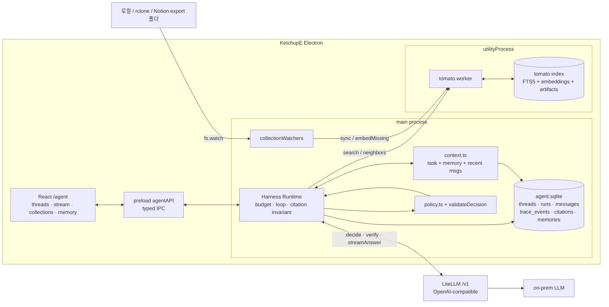

# KetchupE

로컬 문서를 대상으로 동작하는 **on-device RAG agent 클라이언트**입니다. 질문에 근거 있는 답을 하고, 같은 문서를 근거로 계약서·기안서 같은 정형 문서 초안(캔버스)을 만들어 편집합니다. 사용자가 등록한 폴더(로컬, rclone으로 동기화된 Google Drive, Notion export)를 인덱싱하고, agent가 매 step마다 `SEARCH / ASK / VERIFY / ANSWER / STOP` 중 다음 행동을 고른 뒤 citation이 붙은 답변을 만듭니다. 모든 판단은 하나의 trajectory로 로컬 SQLite에 남고, 같은 코드가 벤치마크 러너에서 그대로 돌아갑니다.

설계 근거와 계약 전체는 [KETCHUPE_V3_ARCHITECTURE.md](KETCHUPE_V3_ARCHITECTURE.md)를 보세요. 이 README는 사용법 중심입니다.

## 핵심 기능

- **파일 지정 없는 로컬 검색** — 활성 collection 전체를 한 번에 검색합니다. HWP/HWPX/PDF/DOCX/XLS(X)/MD/TXT/이미지(OCR)를 KorDoc으로 파싱하고, 제목·breadcrumb·페이지 같은 구조와 출처를 보존합니다.
- **자동 동기화** — 폴더를 한 번 등록하면 `fs.watch` + 1.5초 debounce + single-flight sync + 10분 reconciliation으로 변경이 자동 반영됩니다. embedding이 아직 없으면 keyword(BM25) 검색으로 계속 동작하고, 준비되면 hybrid(BM25 + multilingual-e5-small, RRF)로 올라갑니다.
- **명시적 orchestration policy** — 모델이 매 step `PolicyDecision`(action, 난도 0~3, 성공 확률, 근거 충분도, reasonCode)을 반환하고, Harness가 관측 가능한 retrieval signal과 profile별 action/model-call/search/verify/time budget을 기록·강제합니다. 문서 내용은 untrusted data로 취급합니다.
- **지속형 context** — 현재 작업 한 줄, 사용자가 확인한 durable memory(FTS5로 선택), 최근 12개 message를 결정적으로 조합합니다. 모델이 제안한 기억은 사용자가 승인해야 쓰입니다.
- **완전한 trajectory** — `run.started → context.selected → policy.decided → tool.* → model.* → answer.validated → run.completed`와 사용자 반응이 한 run에 묶여 로컬 SQLite에 저장됩니다. 공식 빌드는 서비스 소유 OTLP gateway로 중앙 미러를 남기며, 사용자가 collector나 content mode를 바꾸지 못합니다.
- **문서 작성(캔버스)** — "A사와 용역 계약서 작성해줘"처럼 요청하면 router가 질문(chat)과 문서 작성(doc)을 자동으로 가르고(입력창의 문서 아이콘으로 강제 가능), `classify → 표준 양식 바인딩(모호하면 선택 질문) → 근거 검색 → 초안 → 편집 루프 → 확정` 흐름으로 섹션/블록 구조의 문서를 만듭니다. 블록 단위 수정·추가·삭제·재정렬, 당사자/미정값 입력, 전체 재작성, undo/redo, DOCX 내보내기를 지원합니다. 편집마다 전체 트리 스냅샷이 버전으로 남습니다. MARU의 LangGraph doc graph를 LangGraph 없이 이식한 것입니다.
- **Benchmark harness** — parse / chunk / retrieval / RAG / policy / agent suite를 같은 dataset과 versioned profile로 돌려 A/B 비교합니다. 중앙 trace ingest와 자원 제약 advisor는 [bench.md](bench.md)에 정리했습니다.

## 요구사항

- Node.js **22.5 이상** (`node:sqlite` 사용). Electron 39가 내장한 Node 22.20으로 앱은 그대로 동작하며, 테스트와 bench는 셸의 `node`가 22여야 합니다.
- LiteLLM OpenAI-compatible gateway의 **도메인과 API key**. 모델은 gateway가 노출하는 목록(`GET /models`)의 첫 모델이 자동으로 쓰이며, 설정 화면에서 바꿀 수 있습니다.

```bash
npm install
npm run dev            # Vite + Electron
npm run build          # renderer + main + tomato worker 번들
npm run build:electron # electron-builder 패키징
npm test               # vitest 전체 (jsdom UI + node electron)
npm run test:electron  # 계약·Tomato·harness 테스트만
```

개발 중에는 환경변수로 gateway를 주입할 수 있습니다. 패키징된 앱에서는 설정 화면에서 입력하고 `safeStorage`로 암호화해 저장합니다.

```bash
LITELLM_API_KEY=... [LITELLM_BASE_URL=centinels.ml2-alpha.com] [LITELLM_MODEL_ALIAS=...] npm run dev
LITELLM_API_KEY=... npm run smoke:litellm   # Phase 0 호환성: SSE, tool call, abort, usage
```

## 폴더 구조

```
KetchupE/
├── electron/
│   ├── main.ts                   # 창/트레이/자동 업데이트 + agent runtime 기동
│   ├── preload.js                # window.electronAPI(기존) + window.agentAPI(v3, 좁은 typed IPC)
│   ├── agent/                    # Harness Runtime (main process)
│   │   ├── canvas/               #   문서 작성 흐름: flow.ts(단계·편집 루프), tree.ts(블록 트리 헬퍼), store.ts(버전), presets.ts, prompts.ts
│   │   ├── contracts.ts          #   PolicyState/Decision/Observation/Transition, TraceEvent, LIMITS, validateDecision
│   │   ├── policy.ts             #   policy/answer/verify prompt, profile fingerprint
│   │   ├── modelClient.ts        #   LiteLLM(AI SDK) client + fixture client, /models 자동 해석
│   │   ├── harness.ts            #   유일한 bounded orchestration loop (SEARCH/ASK/VERIFY/ANSWER/STOP)
│   │   ├── tools.ts              #   Tomato tool 실행, evidence 변환, timeout
│   │   ├── verify.ts             #   citation invariant ([[eN]]) + 1회 repair
│   │   ├── context.ts            #   active task → pinned memory → FTS memory → 최근 12 message
│   │   ├── memory.ts             #   pending/confirmed/deleted memory CRUD + FTS
│   │   ├── store.ts              #   workspace/thread/run/message/interaction SQL
│   │   ├── trace.ts              #   trace_events 기록, transition 복원, 내부용 redacted serializer
│   │   ├── telemetry.ts          #   중앙 OTLP trace + durable outbox
│   │   ├── settings.ts           #   model(safeStorage) + 서비스 telemetry 환경 설정
│   │   └── runtime.ts            #   위 모듈 배선 (db, worker, watcher, harness)
│   ├── tomato/                   # local retrieval engine
│   │   ├── tomato.ts             #   scan → KorDoc/Markdown → 구조 chunk → FTS5/BM25 + e5 embedding → RRF
│   │   ├── embedding.ts          #   multilingual-e5-small (q8) via @huggingface/transformers
│   │   ├── text.ts               #   token 추정, CJK FTS 정규화
│   │   ├── protocol.ts           #   main ↔ worker 메시지 계약
│   │   └── tomatoClient.ts       #   utilityProcess handle (timeout, crash 시 lazy restart)
│   ├── workers/tomato.worker.ts  # Electron utilityProcess entry (parse/OCR/embed/search)
│   ├── collectionWatchers.ts     # fs.watch, debounce, single-flight, dirty rerun, reconcile, 재연결
│   ├── db/schema.ts              # agent.sqlite DDL
│   └── ipc/                      # agentHandlers.ts, collectionHandlers.ts (+ 기존 folderHandlers.ts)
├── src/
│   ├── Pages/AgentPage.tsx       # /agent, /agent/:threadId 화면
│   ├── Features/Agent/
│   │   ├── hooks/                # useAgentRun, useCanvasRun, useThreadMessages, useCollections, useMemories, useCanvasDocxExport
│   │   └── components/           # AgentMessages, CanvasPanel, MissingTermsForm, AnchorChoicePrompt, CollectionPanel, MemoryPanel, 설정 폼
│   ├── Features/Sidebar/         # 앱 사이드바: 채널 + 대화 내역(ThreadHistory) + 프로필
│   ├── Contexts/ThreadsProvider  # 사이드바와 에이전트 화면이 공유하는 대화 목록
│   └── app-types/                # Agent.types(IPC), Canvas.types(문서 트리), CanvasEdit.types(편집 op·interrupt)
├── bench/
│   ├── datasets/local-rag-v1/    # corpus/, states/, *-cases.jsonl, memories.jsonl, manifest.json
│   ├── profiles/                 # baseline-v1.json, always-search-v1.json
│   ├── contracts/                # 중앙 trajectory schema
│   ├── runner/                   # suite, Langfuse ingest, compare, advisor
│   └── results/                  # (gitignore) <timestamp>-<profile>-<suite>/
└── scripts/
    ├── litellm-smoke.ts          # model gateway 호환성 4항목
    ├── telemetry-gateway.ts      # public ingest 검증/마스킹 + Langfuse secret 주입
    └── trajectory.ts             # agent.sqlite에서 run/step 조회
```

## 구현된 아키텍처



한 run은 다음 순서로 진행됩니다.

```text
user message
  → context.selected (task, memory ids, message ids, token estimate)
  → decide()  →  validateDecision (schema · action별 필수 필드 · budget)
  → SEARCH  : 같은 query는 재실행 없이 이전 observation 재사용, neighbors로 문맥 확장
  → ASK     : 질문 저장 → run = waiting_user → 다음 user message가 같은 run을 resume
  → VERIFY  : 1회, evidence가 claim을 지지하는지 별도 model call
  → ANSWER  : SSE 스트림 → [[eN]] citation 검증 (1회 repair) → completed
  → STOP    : 사유와 함께 abstained
budget/timeout/cancel은 모델 판단보다 우선하며, 초과 action은 ANSWER(근거 있음) 또는 STOP으로 강제됩니다.
```

## Trajectory 분석

모든 데이터는 로컬에 있습니다.

| 항목 | 위치 |
| --- | --- |
| agent state / trajectory | `userData/agent.sqlite` |
| Tomato index / parse artifact | `userData/tomato/` |
| embedding weight 캐시 | `userData/tomato/models/` |

`userData`는 macOS `~/Library/Application Support/케찹이`, Windows `%APPDATA%\케찹이` 입니다.

### 1. CLI로 보기

```bash
npm run trajectory                          # 최근 run 20개: status, steps, interactions
npm run trajectory -- --run <runId>         # step별 action · reasonCode · 난도 · 성공 확률 · evidence 수 · outcome
npm run trajectory -- --run <runId> --json  # transitions + 전체 trace_events
npm run trajectory -- --db /path/agent.sqlite
```

### 2. SQL로 보기

`trace_events.type = 'policy.decided'`의 payload가 `PolicyTransition`(state, decision, observation, outcome) 계약을 그대로 담고 있어 별도 테이블이 없습니다.

```sql
-- run의 step 목록
SELECT seq,
       json_extract(payload, '$.transition.decision.action')           AS action,
       json_extract(payload, '$.transition.decision.reasonCode')       AS reason,
       json_extract(payload, '$.transition.decision.taskDifficulty')   AS difficulty,
       json_extract(payload, '$.transition.decision.predictedSuccess') AS p_success,
       json_array_length(json_extract(payload, '$.transition.state.evidence')) AS evidence,
       json_extract(payload, '$.transition.outcome')                   AS outcome
FROM trace_events
WHERE run_id = :run AND type = 'policy.decided' AND json_extract(payload, '$.transition') IS NOT NULL
ORDER BY seq;

-- 실패/불확실 후보 (golden set 후보 추출)
SELECT r.id, r.status, r.error_code, i.kind
FROM runs r LEFT JOIN interaction_events i ON i.run_id = r.id
WHERE r.status IN ('failed', 'abstained') OR i.kind IN ('retried', 'corrected');

-- model 호출 latency
SELECT json_extract(payload, '$.purpose') AS purpose, AVG(duration_ms) AS avg_ms, COUNT(*) AS calls
FROM trace_events WHERE type = 'model.completed' GROUP BY purpose;
```

stage 별 event: `input`(run.started) · `context`(context.selected) · `policy`(policy.decided, invalid 시 `payload.invalid = true`) · `retrieval`(tool.started/completed, `cached`, `observation.effectiveMode`) · `verification` · `generation`(model.*) · `citation`(answer.validated: valid/invalid/repaired/failed) · `runtime`(run.completed/failed/waiting_user) · `feedback`(interaction).

### 3. 중앙 수집

제품에 수동 export UI는 없습니다. 완료된 run과 feedback은 `telemetry_outbox`를 거쳐 서비스 소유 OTLP gateway로 전송되고, 관리자가 Langfuse API/Blob Export로 bounded time range를 bench에 ingest합니다.

## Benchmark

같은 `Harness`, `Tomato`, `ModelClient`를 headless로 호출합니다. 벤치용 재구현은 없습니다.

```bash
npm run bench:parse      -- --dataset local-rag-v1 --profile baseline-v1
npm run bench:chunk      -- --dataset local-rag-v1 --profile baseline-v1
npm run bench:retrieval  -- --dataset local-rag-v1 --profile baseline-v1
npm run bench:rag        -- --dataset local-rag-v1 --profile baseline-v1 --client litellm
npm run bench:policy     -- --dataset local-rag-v1 --profile baseline-v1 --runs 3 --client litellm
npm run bench:agent      -- --dataset local-rag-v1 --profile baseline-v1 --runs 3 --client litellm
npm run bench:compare    -- bench/results/<baseline-dir> bench/results/<candidate-dir>
```

Policy 효과는 같은 `--client litellm`로 `always-search-v1`과 `baseline-v1`을 비교합니다. ASK 또는 VERIFY의 기여만 볼 때는 각각 `adaptive-no-ask-v1`, `adaptive-no-verify-v1` profile을 사용하며 retrieval·answer fingerprint가 같아야 합니다.

| suite | 입력 → 출력 | 지표 |
| --- | --- | --- |
| parse | raw file → canonical units | parseSuccess, requiredUnitRecall, locatorAccuracy |
| chunk | units → chunks | goldSpanCoverage, splitViolations, token p50/p95 |
| retrieval | corpus + query → ranked evidence | recall@5/8, mrr@10, ndcg@10, latency p50/p95, effectiveMode |
| RAG | frozen gold evidence + question → answer | correctness, citation validity/coverage, token, latency |
| policy | frozen `PolicyState` → `PolicyDecision` | actionAccuracy, reasonAccuracy, difficulty macro-F1, Brier, ECE, risk-coverage, budgetViolations |
| agent | scripted messages → 전체 run | taskSuccess, `pass^k`, model/tool calls, tokens, CPU/RSS, clarification/verification usage, calibration, citationFailures, latency, firstFailedStage |

- `--client litellm`은 `LITELLM_API_KEY`가 필요합니다. 미지정 시 `always-search`(항상 1회 검색 후 답변하는 규칙 기반 baseline)로 돌아 pipeline 자체를 검증합니다.
- profile의 `"${LITELLM_MODEL_ALIAS}"`는 환경변수 또는 gateway의 첫 모델로 치환됩니다. key는 profile·결과에 기록되지 않습니다.
- 결과는 `bench/results/<timestamp>-<profile>-<suite>/`에 `manifest.json`(git sha, OS, dataset/profile hash, fingerprint) · `runs.jsonl`(case별 결과와 `firstFailedStage`) · `summary.json`으로 남습니다. `bench:compare`가 두 summary의 delta와 방향(better/worse)을 출력합니다.
- Retrieval/agent suite는 embedding weight를 `bench/results/.models/`에 한 번만 받습니다.
- Parser/chunker/retriever를 바꿀 때는 policy와 model을 고정하고, policy/prompt를 바꿀 때는 corpus·retrieval profile·model을 고정하세요. 승격 조건은 [아키텍처 문서 §12.6](KETCHUPE_V3_ARCHITECTURE.md)에 있습니다.

`local-rag-v1`은 현재 합성 corpus에 구현자가 붙인 seed label이며 2차 검토 전입니다(`manifest.json`의 `status`). 실제 trajectory는 `Langfuse ingest → 비식별화 확인 → 사람 label → 2차 검토 → version + SHA-256 고정`을 거쳐야만 golden set으로 승격합니다.

## 모니터링과 A/B (Langfuse)

여러 사용자의 trajectory를 서비스 관리자가 한곳에서 보도록 **KetchupE OTLP gateway → Langfuse** 경로를 사용합니다. Desktop은 public ingest token만 알고 Langfuse secret은 gateway가 보유합니다. 로컬 SQLite는 제품 상태의 원본과 내구성 있는 outbox이고, Langfuse는 운영 분석과 평가 후보 선별용 중앙 미러입니다.

### 무엇이 전송되나

| Langfuse 객체 | 원천 | 내용 |
| --- | --- | --- |
| trace `agent.run` (run 1개 = trace 1개) | `runs` + `trace_events` | HMAC user/session ID, variant, profile SHA 3종, corpus snapshot, action/step/search/verify/model/token/citation/error 집계 |
| agent `policy.step.N` | `policy.decided` | policy state/decision, reasonCode, taskDifficulty, predictedSuccess, evidenceSufficiency, budget, outcome |
| retriever `tool.search_local_docs` / `tool.get_document_context` | `tool.completed` | query/anchor input, evidence 결과 output, cached 여부, 결과 수, effectiveMode, tool error |
| generation `model.policy|verify|answer` | `model.completed` | model alias, latency, input/output tokens |
| trace `app.session` | 앱 실행 | 실행 1회당 1개. DAU/MAU 집계용 |
| trace `index.sync` / span `embed.batch` | Tomato watcher | scan/update/remove/fail, embedding model/dimension/throughput, latency |
| evaluator observation `runtime/*`, `agent/*`, `user/*` | run 종료·사용자 반응 | completion/citation/calibration/step/search/feedback 수치 |

공식 기본값인 `ops`는 자유 텍스트와 ID를 설치별 HMAC으로 바꾸고 구조·수치·오류 코드만 유지합니다. `redacted_eval`은 관리자 평가용 텍스트를 마스킹해 보내고, `internal_full`은 통제된 사내 corpus에만 쓸 수 있습니다. absolute path, API key, hidden chain-of-thought는 어떤 모드에서도 전송하지 않습니다. 모든 observation은 `ketchupe-trajectory-v2`와 profile SHA, variant를 가지므로 bench가 trace를 재구성할 수 있습니다.

### 설정

사용자 설정 UI는 없습니다. 공식 빌드가 `KETCHUPE_OTLP_ENDPOINT`, public `KETCHUPE_OTLP_TOKEN`, content mode, environment, tenant를 고정합니다. Langfuse public/secret key는 gateway 프로세스에만 설정합니다.

```bash
KETCHUPE_OTLP_ENDPOINT=https://telemetry.example.com/v1/traces KETCHUPE_OTLP_TOKEN=public-token npm run dev
LANGFUSE_PUBLIC_KEY=pk-lf-… LANGFUSE_SECRET_KEY=sk-lf-… KETCHUPE_INGEST_TOKEN=public-token npm run telemetry:gateway
```

전송 전 항목은 local SQLite `telemetry_outbox`에 기록합니다. 실패하면 최대 5분의 bounded backoff로 재시도하며, 앱을 재시작해도 미전송 항목이 남습니다. 앱 종료 시에도 한 번 flush합니다. 완료된 run과 evaluator observation은 고유 ID로 중복을 방지합니다.

별도 bench는 Langfuse의 [`GET /api/public/v2/observations`](https://langfuse.com/docs/api-and-data-platform/features/observations-api)를 bounded time range로 읽거나 [blob storage export](https://langfuse.com/docs/api-and-data-platform/features/export-to-blob-storage)의 `observations_v2`를 ingest합니다. runtime과 user feedback 수치도 evaluator observation으로 보내므로 client outbound는 OTLP 하나로 유지됩니다. 구체적인 스키마·실행·golden set 승격·연구 근거는 [bench.md](bench.md)를 보세요.

이 ingest 결과로 실패 case를 선별하고 offline scorer의 입력을 구성할 수 있습니다. retrieval recall을 재실행하려면 distractor를 포함한 전체 corpus가 필요하므로 사용자 파일 전체를 자동 업로드하지 않고, 사람이 비식별화·승인한 corpus package를 bench dataset에 별도로 붙입니다.

### 무엇을 볼 수 있나

- **DAU / MAU** — Langfuse *Users* 화면, 또는 Metrics API로 `traces` view를 `userId` dimension + `day` granularity로 집계합니다. 앱 실행(`app.session`)과 run(`agent.run`) 모두 `user.id`를 달고 있어 "실행만 한 사용자"와 "질문한 사용자"를 나눠 볼 수 있습니다(trace name으로 필터).
- **workflow의 약한 지점** — trace를 `status`/`errorCode`로 필터하고 `policy.step.N`의 `reasonCode`·`effectiveMode`·`outcome`을 보면 실패가 retrieval, policy, citation 중 어디서 나는지 분리할 수 있습니다. `agent/predicted_success`와 `user/*` evaluator를 함께 보면 calibration을 실사용 데이터로 확인할 수 있습니다.
- **업그레이드 전후 비교** — `service.version`과 profile SHA로 그룹을 나눠 `runtime/completed`, `runtime/steps`, `runtime/searches`, token, latency를 비교합니다.
- **A/B** — 정책 variant는 [policy.ts](electron/agent/policy.ts)의 `POLICY_VARIANTS`에 정의하고(현재 `always-search-v1`, `adaptive-v1`), install id의 hash로 결정적으로 배정합니다. 두 arm은 같은 answer model을 사용하고 decision strategy만 다릅니다. 모든 trace에 `variant` tag/metadata가 붙으므로 Langfuse에서 variant별 score 평균을 비교하면 됩니다.

Langfuse에서 `failed`·`corrected`·낮은 `agent/predicted_success` run을 고른 뒤 마스킹·사람 label·이중 검토를 거쳐야만 `bench/datasets/`로 승격합니다. Production trace를 바로 gold로 쓰지 않습니다.

## v2에서 바뀐 것

v2의 MARU 챗봇(`/chatbot`), 로그인, 팀, 팀 폴더 업로드는 모두 제거했습니다. 케찹이는 서버 없이 로컬에서 동작하며 외부 연결은 LiteLLM gateway와 (선택) Langfuse뿐입니다. 사이드바는 대화 내역을 보여주고 `/agent`가 기본 화면입니다. MARU는 파일 관리 시스템으로 축소되며 케찹이가 직접 호출하지 않습니다.

## License

MIT
